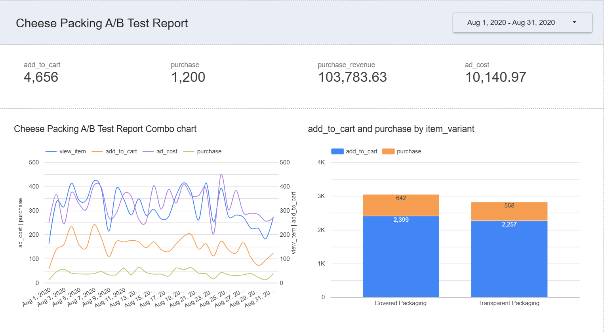

# Cheese Packaging A/B Test

## Project Overview

This project evaluates how packaging design influences customer behavior and sales performance in an e-commerce environment.

Using a structured A/B test dataset, I analyzed the performance of Transparent Packaging versus Covered Packaging using SQL, Python, Tableau, and Power BI.

The objective was to identify which packaging design generated stronger customer engagement, higher conversion rates, and greater revenue.

---

## Business Problem

Packaging design can significantly influence customer perception and purchasing behavior.

The business needed a data-driven approach to determine whether Transparent Packaging or Covered Packaging produced better results across the digital purchase funnel.

Key business question:

**Which packaging type drives higher customer engagement and revenue?**

---

## Dashboard Preview

---

## Tools Used

* SQL
* Python
* Tableau
* Power BI
* Excel

---

## Methodology

### Data Preparation

* Structured A/B test dataset containing 1,000 users
* 500 users assigned to Transparent Packaging
* 500 users assigned to Covered Packaging
* SQL aggregation of funnel performance metrics

### Analysis

* Calculated add-to-cart conversion rates
* Calculated purchase conversion rates
* Evaluated total revenue generated by each variant
* Measured performance lift across the purchase funnel

### Visualization

* Tableau dashboards
* Power BI dashboards
* Funnel performance comparisons
* Variant-level KPI tracking

---

## Key Results

| Metric                   | Transparent Packaging | Covered Packaging |
| ------------------------ | --------------------- | ----------------- |
| Purchase Conversion Rate | 8.0%                  | 5.6%              |
| Add-to-Cart Rate         | 19.2%                 | 15.0%             |
| Revenue                  | $399.96               | $286.88           |

### Performance Improvements

* 42.9% higher purchase conversion rate
* 28% higher add-to-cart rate
* 39.4% higher revenue generation
* Stronger funnel efficiency from product view to purchase

---

## Business Recommendations

* Prioritize Transparent Packaging for primary product listings
* Standardize A/B testing for future packaging experiments
* Monitor full-funnel performance metrics continuously
* Expand testing to additional products and packaging variants

---

## Skills Demonstrated

* A/B Testing
* Statistical Analysis
* SQL
* Python
* Tableau
* Power BI
* Data Visualization
* Business Intelligence

---

## Project Outcome

The analysis demonstrated that Transparent Packaging consistently outperformed Covered Packaging across every stage of the customer purchase funnel.

The results suggest that increased product visibility improves customer confidence, leading to higher conversion rates and greater revenue generation.
