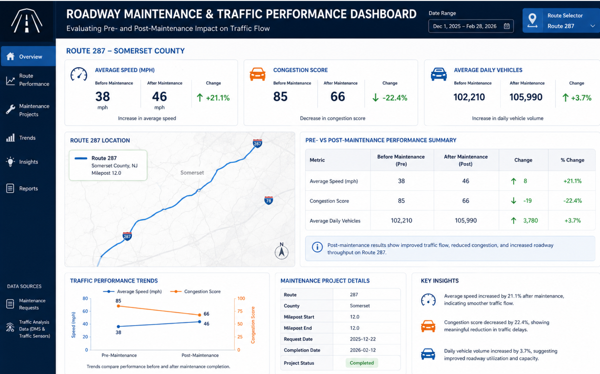
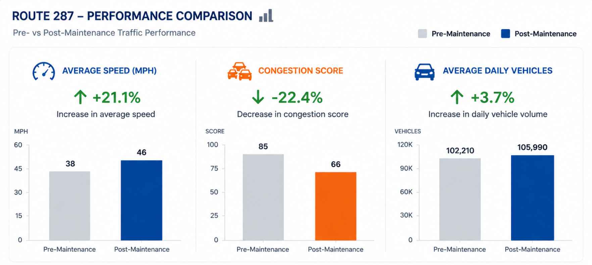

# Transportation Operations Intelligence Dashboard

## Project Overview

This project analyzes roadway maintenance performance across Interstate 287 using internal indexing software and PowerBI.

The objective was to identify roadway segments where maintenance activities generated the greatest improvement in traffic conditions and to develop a repeatable framework for prioritizing future maintenance investments.

---

## Business Problem

Interstate 287 is one of New Jersey's busiest commuter corridors, carrying significant daily traffic volume across multiple roadway segments.

Transportation stakeholders need a data-driven method for:

* Identifying roadway segments most in need of maintenance
* Prioritizing maintenance investments
* Measuring operational improvements after maintenance activities
* Monitoring roadway performance through centralized reporting

---

## Dashboard Preview

---

## Tools Used

* SQL
* Python
* Tableau
* Power BI
* Excel

---

## Methodology

### Data Preparation

* Extracted and transformed roadway maintenance records using SQL
* Integrated traffic sensor and roadway performance data
* Cleaned and structured datasets for analysis

### Analysis

* Evaluated roadway performance before and after maintenance activities
* Analyzed traffic volume, vehicle speed, and congestion metrics
* Identified roadway segments with the highest potential operational impact

### Visualization

* Built interactive dashboards in Tableau and Power BI
* Developed KPI tracking for roadway performance monitoring

---

## Key Results

| Metric                | Improvement     |
| --------------------- | --------------- |
| Congestion Score      | 20.5% Reduction |
| Average Vehicle Speed | 19.5% Increase  |
| Daily Vehicle Volume  | 4.8% Increase   |

---

## Results Dashboard

---

## Business Recommendations

* Prioritize maintenance on high-volume roadway segments
* Automate roadway prioritization using traffic and congestion metrics
* Standardize post-maintenance performance tracking
* Expand roadway performance monitoring to additional corridors

---

## Skills Demonstrated

* Data Analysis
* SQL Query Development
* Python Analytics
* Dashboard Development
* Tableau
* Power BI
* Business Intelligence
* Data Visualization

---

## Project Outcome

The analysis demonstrated that roadway segments with high traffic volume and elevated congestion scores produced the greatest operational improvements following maintenance activities. The resulting dashboard provides transportation stakeholders with a centralized tool for monitoring roadway performance and prioritizing future maintenance investments.
